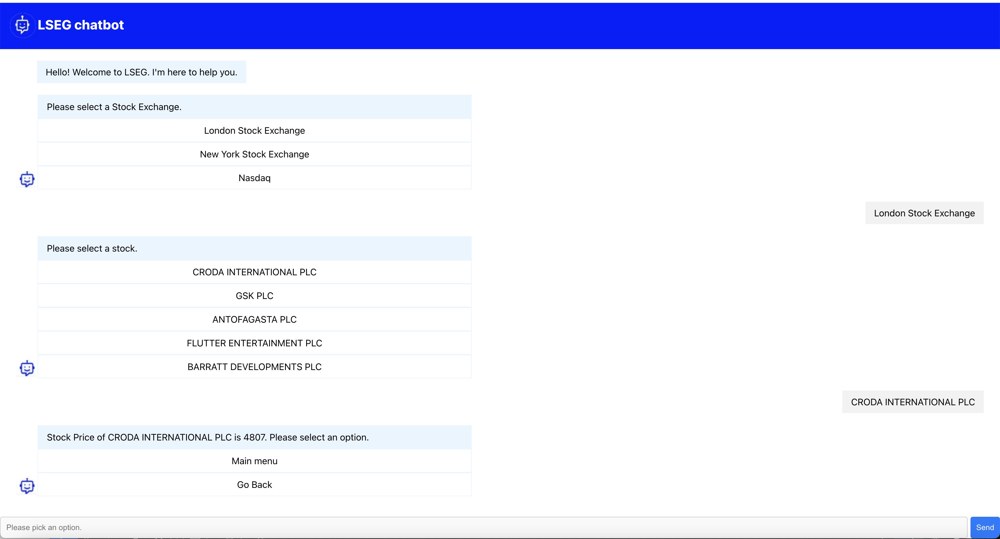

# Stock Chatbot
 Boilerplate project for stock management system with chatbot.

# Project Overview
 This project comprises two microservices designed to meet the specified requirements:

 - **Chatbot UI Service**:
  This microservice guides users in selecting stock menu options through an interactive chatbot interface.

 - **Stocks API Service**:
  This service provides stock exchange data based on user selections, ensuring accurate and timely information.

# Project Structure:
```
stock-chatbot
.
├── chatbot-ui
│   ├── Dockerfile
│   ├── package.json
│   ├── public
│   │   ├── chatbot-header.png
│   │   ├── chatbot-msg.png
│   │   ├── index.html
│   ├── src
│   │   ├── App.css
│   │   ├── App.tsx
│   │   ├── components
│   │   │   ├── Chatbot.css
│   │   │   ├── Chatbot.tsx
│   │   │   ├── DynamicRenderer.tsx
│   │   │   ├── HomeMenu.tsx
│   │   │   ├── PriceMenu.tsx
│   │   │   ├── StockMenu.tsx
│   │   │   ├── ThemeContext.tsx
│   │   │   └── UserMessage.tsx
│   │   ├── index.css
│   │   ├── index.tsx
│   │   └── tests
│   │       ├── App.test.tsx
│   │       └── Chatbot.test.tsx
│   └── tsconfig.json
└── stocks-api
    ├── Dockerfile
    ├── jest.config.js
    ├── package.json
    ├── src
    │   ├── __tests__
    │   │   └── stocks.test.ts
    │   ├── index.ts
    │   ├── routes
    │   │   └── v1
    │   │       ├── empty-stocks.json
    │   │       ├── stock-data.json
    │   │       └── stocks.ts
    │   └── utils
    │       └── errorHandler.ts
    └── tsconfig.json
├── README.md
├── build-push-images.sh
├── docker-compose.yml
```


**How to run the project ?**

1. **Option1**: quickest way to run the application - recommended
 
    You can run the application using docker compose with `docker-compose up` command (run on the root directory)

    Runs the app in the development mode.\
    Open [http://localhost:3000](http://localhost:3000) to view it in the browser.

    **Prerequisites**:
    Make sure, docker desktop should install and running


2. **Option2**: docker platform not required
    
    You can manually build and start in both micro services on seperate shell prompt as bellow

    ```
        shell1: cd stocks-api
            npm install
            npm run build
            npm start
    ```

    Runs the app in the development mode.\
    Open [http://localhost:7000](http://localhost:7000/api/v1/exchanges) to view it in the browser.

    ```
        shell2> cd chatbot-ui
         npm install
         npm run build
         npm start
    ```
    Runs the app in the development mode.\
    Open [http://localhost:3000](http://localhost:3000) to view it in the browser.

**Running Tests**: optinal
  
   Run the tests using `npm run test` command on both microservices


**What are the things inside those micro-services and recommendation ?**

#### Major Language/Platform Versions
 - Backend: Node.js 18.x, Express 5.x
 - Frontend: React.js 18.x, TypeScript 5.x
 - Testing: Jest 29.x


### Backend:
 This project features a medium-scale backend service built with Express and Node.js. It includes versioning to effectively manage traffic, serving as a proof of concept (POC).
 
 Implemented simple unit tests using the Jest framework to ensure code quality and reliability.


#### Recommendations:
 GraphQL: Utilize the GraphQL package for improved response times, better caching, and to efficiently handle build requests for enterprise-scale applications.

 API Gateway: Implement an API Gateway to enhance security (authentication & authorization), performance (routing, rate limiting, pagination, filtering, versioning), and caching mechanisms.

 Content Delivery Networks (CDNs): Use CDNs along with optimized caching strategies to effectively manage backend traffic at scale.

 Database per Service: Adopt a microservices architecture with a dedicated database for each service, choosing the database based on specific business requirements and best practices.

### Frontend
 The frontend is developed as a simple boilerplate UI layer using React and TypeScript. It displays stock menus based on user selections according to project requirements.

 Included a simple dynamic theme change feature for the header section of the chatbot UI, allowing users to customize their experience based on their preferences.

 Included simple unit tests using the Jest framework to validate functionality.


  #### Recommendations:
   Chatbot Integration: handle chatbot conversations efficiently at scale to enhance user interaction.

   Authentication & Authorization:  Implement robust authentication and authorization mechanisms to secure user data.

   Stock Recommendations: Provide personalized stock recommendations based on user interests.

   Real-time Stock Management: Allow users to watch stocks and buy/sell at any time.

   User Dashboard: Create a dashboard to display all user activities, complete with performance indicators for better insights.
  

 ### Build and Push Docker Images

  1. *Option1*: recommended
    
        We can build and push the both docker images into the docker hub using `build-push-images.sh` script.

        Expose below environment variables before run it

        export DOCKER_REGISTRY_PREFIX=your-docker-user-name-with-slash
        export BUILD_NUMBER=versionname

        sh1> chmod +x build-push-images.sh
             ./build-push-images.sh

        Note: 
        docker push command is commented, please uncomment it if you wanted to push it  you have to login before push it using `docker login` command

        Please change the environment variables in .env file if you are using different dockerhub account.

  2. *Option2*:
        
        Run the below commands on both services to build and publish to dockerhub account

        Ex:
        
        sh1> 
         DOCKER_REGISTRY_PREFIX=your-docker-user-name-with-slash BUILD_NUMBER=latest npm run build-dev-image (build the image)
    
        DOCKER_REGISTRY_PREFIX=ganeshs777/ BUILD_NUMBER=latest publish-image (push image into docker hub, login before procced)


 ### POC Objective:

 Create a chatbot that enables user to select any of 3 Stock Exchanges (LSEG, NASDAQ, NYSE) and for the selected exchange provides 5 stocks that are traded in that exchange. User can then select any one of those stocks to view the latest stock price.


